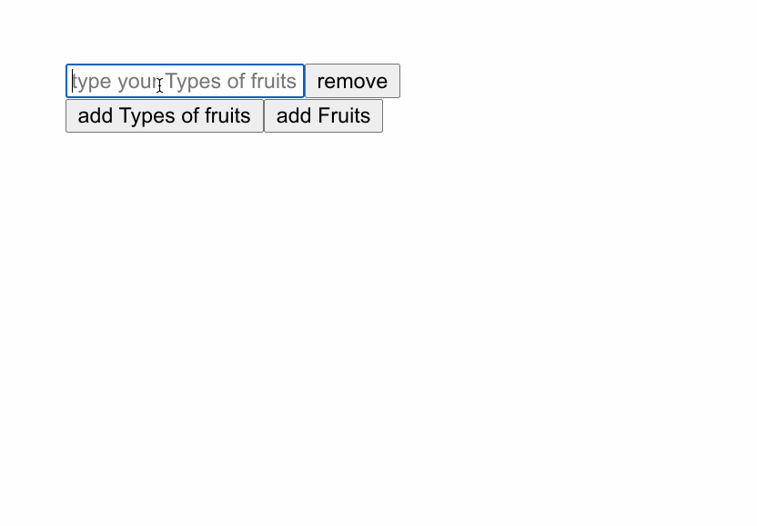

# react-dynamic-fields

> A package to make it easy to auto add fields in react and collect the data

[](https://www.npmjs.com/package/react-dynamic-fields) [](https://standardjs.com)

## Install

```bash
npm install --save react-dynamic-fields
```

## Usage

```tsx
import React from 'react'
import { SingleField, DoubleField } from 'react-dynamic-fields'

const App = () => {
  const nums = {
    value: '',
    category: ''
  }
  const [options, setOptions] = React.useState([''])
  const [numbers, setNumbers] = React.useState([nums])

  return (
    <React.Fragment>
      <SingleField
        options={options}
        setOptions={setOptions}
        label='Types of fruits'
      />

      <DoubleField
        options={numbers}
        setOptions={setNumbers}
        initialValue={nums}
        data={{
          label: 'Fruits',
          name: 'fruits',
          types: options
        }}
      />
    </React.Fragment>
  )
}
```
Single Option demo   


Single and Double Field Options demo   



## License

MIT © [OlivierJM](https://github.com/OlivierJM)
