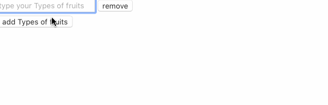

# react-dynamic-fields

> A package to make it easy to auto add fields in react and collect the data

[](https://www.npmjs.com/package/react-dynamic-fields) [](https://standardjs.com)

## Install

```bash
npm install --save react-dynamic-fields
```

## Usage

```tsx
import React from 'react'
import SingleField from 'react-dynamic-fields'

const App = () => {
  const [options, setOptions] = React.useState([''])
  return (
    <SingleField
      options={options}
      setOptions={setOptions}
      label='Types of fruits'
    />
  )
}
```



## License

MIT © [OlivierJM](https://github.com/OlivierJM)
